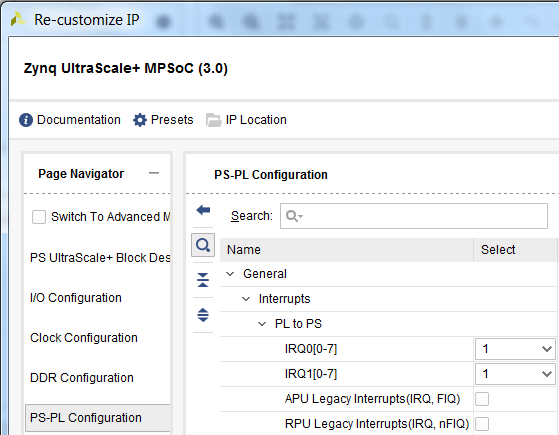
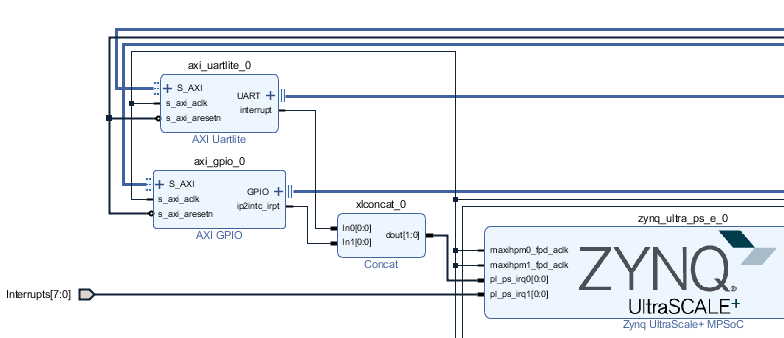
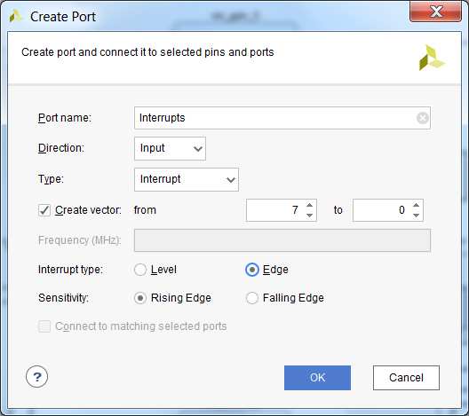

## 硬件连接

MPSoC 可以接收两组来自 PL 的中断信号。在 Vivado 中，可以通过 `PS-PL Configuration -> General -> Interrupts -> PL to PS -> IRQ0/IRQ1` 打开。 



对应的硬件中断号分别是
- PL PS Group 0: 121-128
- PL PS Group 1: 136-143

这两组中断信号既可以与 IPI 中的 IP 的中断信号相连接，也可以和 Verilog 中的逻辑相连接。如果有多个中断源要连接到一组信号中，可以使用`concat`将多个信号组合成一组信号，然后连接到 IRQ。



如果要从 Verilog 引入中断信号，需要在 IPI 中按右键选择 `Create Port`。Port Type 选择为 `Interrupt`。



## 软硬件的桥梁: device tree

硬件信息怎样传送给软件系统？

Linux 的答案是 [Device Tree](http://www.wiki.xilinx.com/Device+Tree+Tips)。

以下是 Device Tree Generator 为上图中的 AXI UARTLite 自动创建的 device tree。

```
axi_uartlite_0: serial@a0000000 {
         clocks = <&misc_clk_0>;
         compatible = "xlnx,xps-uartlite-1.00.a";
         current-speed = <115200>;
         device_type = "serial";
         interrupt-parent = <&gic>;
         interrupts = <0 89 1>;
         port-number = <1>;
         reg = <0x0 0xa0000000 0x0 0x10000>;
         xlnx,baudrate = <0x2580>;
         xlnx,data-bits = <0x8>;
         xlnx,odd-parity = <0x0>;
         xlnx,s-axi-aclk-freq-hz-d = "99.999";
         xlnx,use-parity = <0x0>;
      };
```

### 创建 Device Tree
Device tree 是纯文本文件，后缀是 `.dts` 或 `.dtsi`。当然可以手工从头开始写（似乎没人这么做），Xilinx 也提供了工具来帮助自动生成。

一种方法是使用 PetaLinux，其实这也是 petalinux-build 中的一个步骤。当在一个 PetaLinux 工程中导入 HDF 后，运行 `petalinux-build`它会自动调用 Device Tree Generator (DTG)，为你的工程产生 device tree。用户可以在自动生成的文件的基础上进一步修改，修改的时候注意文件都上会写哪些文件重新生成时会被覆盖，哪些不会。

另一种生成 device tree 的方法是使用 SDK。SDK 可以把 DTG 加载为 BSP Generator，用来生成 device tree. DTG 的下载地址是 [https://github.com/Xilinx/device-tree-xlnx]。下载到本地后，在 SDK 的 `Xilinx Tools -> Repositories` 中添加解压后的目录。在 SDK 中新建一个 BSP, BSP 类型选择 `device_tree`

    Note: 如果是SDx工具，加载DTG的方法是 Window -> Preference -> Xilinx SDK -> Repositories


### Interrupt 属性的定义

Device tree 中和中断相关的属性有两条，`interrupts`和`interrupt-parents`。

`interrupt-parents`指向了中断控制器。在 MPSoC 中有多个外设都有中断控制器属性，分别是 GIC, GPIO, PCIe。 

`interrupts` 后的参数指定了中断号和中断属性。

[Device tree bindings interrupts.txt](https://github.com/Xilinx/linux-xlnx/blob/master/Documentation/devicetree/bindings/interrupt-controller/interrupts.txt) 中定义了 interrupts 后参数的意义。需要注意的是，在中断控制器的属性中有`#interrupt-cells`的定义，表示`interrupts`参数需要几个32位的字符。常见的情况是1到3。1个Cell的情况只填写中断号。2个Cell的情况填写中断号和触发条件，GPIO Controller就是这种情况。

ARM GIC 使用的是 3 个 Cell：

- 第一个 cell 是 0 的话表示中断类型：0 for SPI interrupts, 1 for PPI
  interrupts。PL 到 PS 的中断属于 SPI，所以填写 0。
- 第二个 Cell 表示中断号
- 第三个 Cell 表示中断触发方式。

ARM GIC v3 中断 Cell 说明，来自 [arm,gic-v3.txt](https://github.com/Xilinx/linux-xlnx/blob/master/Documentation/devicetree/bindings/interrupt-controller/arm,gic-v3.txt)
```
  The 1st cell is the interrupt type; 0 for SPI interrupts, 1 for PPI
  interrupts. Other values are reserved for future use.

  The 2nd cell contains the interrupt number for the interrupt type.
  SPI interrupts are in the range [0-987]. PPI interrupts are in the
  range [0-15].

  The 3rd cell is the flags, encoded as follows:
	bits[3:0] trigger type and level flags.
		1 = edge triggered
		4 = level triggered
```


### 中断号的确定

Device tree 中 interrupts 的中断号请填写硬件`硬件中断号 - 32`


## 中断的驱动程序

PetaLinux 中自带了中断服务程序的例子。

用命令 `petalinux-create -t modules -n mymodule`就可以创建出例子程序。

其中与注册 IRQ 中断号相关的语句为：

```
/* Get IRQ for the device */
   r_irq = platform_get_resource(pdev, IORESOURCE_IRQ, 0);
   if (!r_irq) {
      dev_info(dev, "no IRQ found\n");
      dev_info(dev, "mymodule at 0x%08x mapped to 0x%08x\n",
         (unsigned int __force)lp->mem_start,
         (unsigned int __force)lp->base_addr);
      return 0;
   }
   lp->irq = r_irq->start;
   rc = request_irq(lp->irq, &mymodule_irq, 0, DRIVER_NAME, lp);
   if (rc) {
      dev_err(dev, "testmodule: Could not allocate interrupt %d.\n",
         lp->irq);
      goto error3;
   }
```
注意上面的程序是通过读取 dts 获取中断的信息，然后让操作系统分配一个虚拟中断号。以前注册中断号是通过手工在 C 代码中填入中断号，现在这种方法不可行了，请使用虚拟中断号的方法。